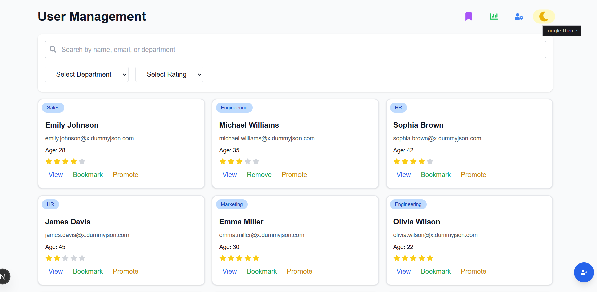
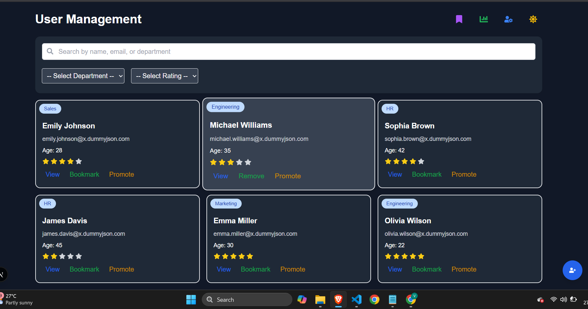
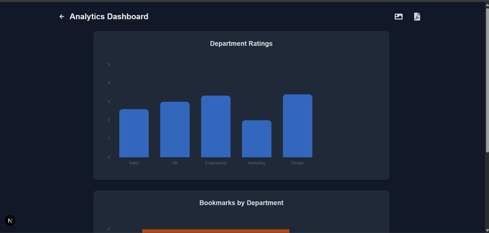
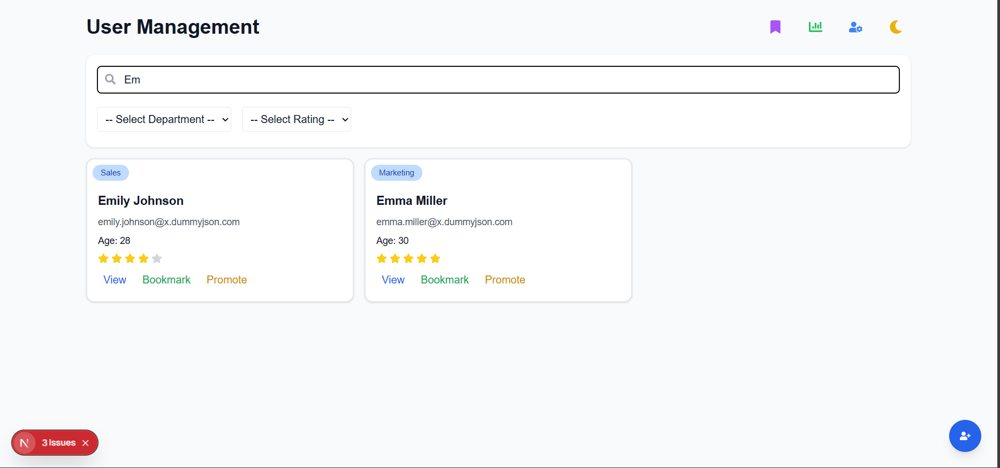
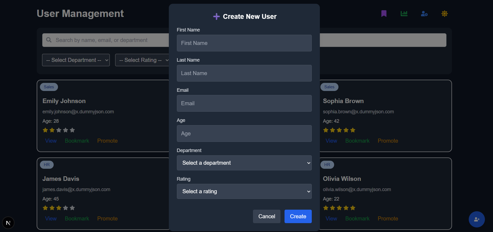

# HR Dashboard

[](https://vercel.com/vandanamvs-projects/hr-dashboard)

A modern HR dashboard built with [Next.js](https://nextjs.org), styled using Tailwind CSS.

## Setup Instructions

1. **Clone the repository:**
   ```bash
   git clone https://github.com/vandanamv/HR-Dashboard.git
   cd hr-dashboard
   ```
2. **Install dependencies:**
   ```bash
   npm install
   # or
   yarn install
   # or
   pnpm install
   # or
   bun install
   ```
3. **Run the development server:**
   ```bash
   npm run dev
   # or
   yarn dev
   # or
   pnpm dev
   # or
   bun dev
   ```
4. Open [http://localhost:3000](http://localhost:3000) in your browser.

## Features Implemented

- User authentication (login page)
- Employee directory with search and filter
- Employee detail pages
- Analytics dashboard with charts (department ratings, bookmark trends, etc.)
- Bookmarks management
- User management (create, edit, promote users)
- Settings page
- Responsive design

## Screenshots

### Homepage (Light & Dark)



### Analytics Dashboard


### Search Feature


### New User Creation


---

This project uses [`next/font`](https://nextjs.org/docs/app/building-your-application/optimizing/fonts) to automatically optimize and load [Geist](https://vercel.com/font).

## Learn More

- [Next.js Documentation](https://nextjs.org/docs)
- [Learn Next.js](https://nextjs.org/learn)
- [Next.js GitHub repository](https://github.com/vercel/next.js)

## Deploy on Vercel

The easiest way to deploy your Next.js app is to use the [Vercel Platform](https://vercel.com/new?utm_medium=default-template&filter=next.js&utm_source=create-next-app&utm_campaign=create-next-app-readme).

Check out the [Next.js deployment documentation](https://nextjs.org/docs/app/building-your-application/deploying) for more details.
